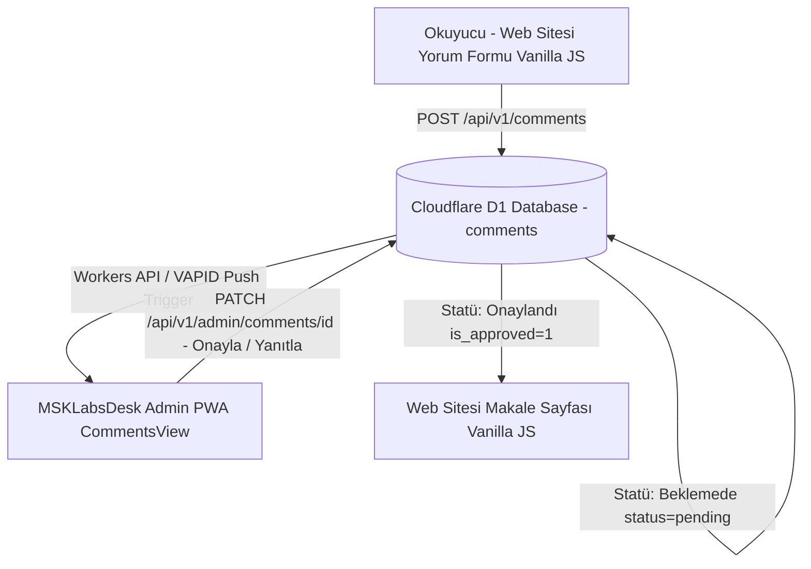

# MSK Labs - Blog Yorum & Yönetim/Bildirim Sistemi Tasarım Taslağı

> ⚠️ **[HISTORICAL / SUPERSEDED DRAFT]**  
> **ÖNEMLİ UYARI:** Bu belge 29 Eylül 2026 tarihli önceki tasarım çalışmasının tarihsel devamıdır. Buradaki Supabase, Firebase, Telegram, Electron ve PyQt önerileri güncel mimarinin aktif teknoloji kararları değildir.
> 
> **GÜNCEL AKTİF MİMARİ (`MSKLabsDesk/tasks.md`):**
> - **Veritabanı (Edge DB):** Cloudflare D1 (`comments` ve `messages` tabloları).
> - **Serverless Backend API:** Cloudflare Edge Workers TypeScript API (`POST/GET /api/v1/comments`, `PATCH /api/v1/admin/comments`).
> - **Yönetim Paneli (Admin App):** `MSKLabsDesk` Admin PWA (`CommentsView.tsx`, `TicketsView.tsx`). *Not: React + Vite + TypeScript çatısı YALNIZCA Admin PWA uygulaması içindir; kamuya açık `webMSKLabs` kamu portalı Vanilla HTML5 / CSS3 / JavaScript mimarisini korur.*
> - **E-posta & Bildirim:** Resend Email API (`COM-001`/`COM-002`) ve VAPID Web Push (`COM-003`).

---

## 1. Vizyon ve Temel İlkeler

1. **Etkileşim ve Şeffaflık:**  
   Okuyucuların makalelere yorum yapabilmesi, düşüncelerini paylaşabilmesi ve MSK Labs ekibiyle iletişim kurabilmesi hedeflenir.
2. **Onaylı (Moderasyonlu) Yayıncılık:**  
   Hiçbir yorum doğrudan web sitesinde yayınlanmaz. Her yorum öncelikle "Beklemede" (`pending`) statüsünde tutulur ve yönetim onayından geçtikten sonra yayına alınır.
3. **Özel Yönetim & Bildirim Arayüzü (Masaüstü + Mobil Entegre Admin PWA):**  
   Harici botlar (Telegram vb.) veya Supabase/Firebase yerine, tüm onay, red, yanıtlama ve destek süreçlerini yönetecek **`MSKLabsDesk` Admin PWA Paneli** ve Cloudflare Workers API altyapısı kullanılacaktır.

---

## 2. Özel Masaüstü & Mobil Yönetim Uygulaması Konsepti

### A. Anlık Bildirim (Web Push Notification & Resend Email)
* Web sitesinden yeni bir yorum veya destek/talep geldiğinde, masaüstü veya mobil cihazda VAPID Web Push anlık bildirimi düşer.
* Bildirim içeriğinde:
  * Makale Adı / Bölüm (BİZCE, GÜNCEL, ANILTILAR)
  * Gönderen Rumuz/İsim
  * Yorumun Kısa Özeti yer alır.

### B. Hızlı Aksiyon & Yanıtlama Ekranı
`MSKLabsDesk` Admin PWA (`CommentsView.tsx`) içerisinden tek tıkla gerçekleştirilebilecek aksiyonlar:
1. **[ Onayla & Yayınla ]:** Yorum derhal web sitesinde ilgili makalenin altında görünür hale gelir (`isApproved = true`).
2. **[ Düzenle & Onayla ]:** İmla hataları veya ufak düzenlemeler yapılarak onaylanır.
3. **[ Reddet / Sil ]:** Uygunsuz, ilgisiz veya spam yorumlar tek tıkla elenir.
4. **[ MSK Labs Ekibi Olarak Yanıtla ]:** Okuyucunun yorumunun altına resmi ekip yanıtı yazılır. Web sitesinde "MSK Labs Ekibi" rozetiyle yayınlanır.

---

## 3. Sistem Mimarisi & Veri Akışı

### Güncel Teknolojik Bileşenler (`MSKLabsDesk/tasks.md`):
* **Veritabanı / Backend:** Cloudflare D1 (Edge SQLite DB) + Cloudflare Workers TypeScript API.
* **Yönetim Uygulaması (Admin PWA):** React 18 + Vite + TypeScript PWA (`MSKLabsDesk`).
* **Public Web Portalı (`webMSKLabs`):** Vanilla HTML5 / CSS3 / JavaScript.
* **E-posta & Bildirim:** Resend Email API + VAPID Web Push.

### `[HISTORICAL / SUPERSEDED]` Önceki Taslak Önerileri:
* *Veritabanı:* Supabase / Firebase (Kullanılmıyor, yerini Cloudflare D1 almıştır).
* *Masaüstü / Mobil Uygulama:* Electron / PyQt / Flutter (Kullanılmıyor, yerini Cloudflare PWA Admin almıştır).

---

## 4. Güvenlik, Gizlilik ve Spam Önlemleri

1. **E-posta Gizliliği:** Okuyucunun e-posta adresi web sitesinde veya üçüncü şahıslara kesinlikle gösterilmez. Yalnızca rumuz/isim görüntülenir.
2. **Akıllı Spam Filtresi (Honeypot):** Otomatik botların form doldurmasını engelleyen kullanıcıyı yormayan gizli güvenlik katmanları.
3. **Küfür / Nefret Söylemi İncellemesi:** Yönetici onayından önce temel kelime filtrelemesi.

---

## 5. İleride Detaylandırılacak & İstişare Edilecek Konular

- [ ] Yorumlara diğer okuyucuların reaksiyon (Beğen / Katılıyorum / Düşündürücü) verebilmesi.
- [ ] Masaüstü uygulamasının sadece yorumları değil, Destek & Talep formlarını da tek merkezden yönetebilmesi.
- [ ] Ekip üyeleri arasında yetkilendirme (Hangi yazının yorumunu kimin onaylayabileceği görevi).
- [ ] Bildirim sesleri, sessiz saatler ve mobil senkronizasyon tercihleri.
